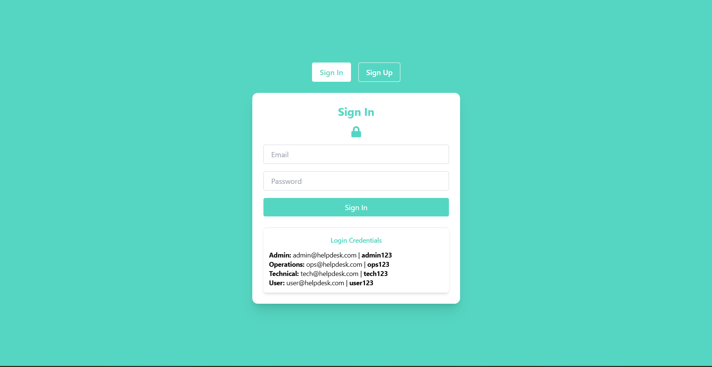
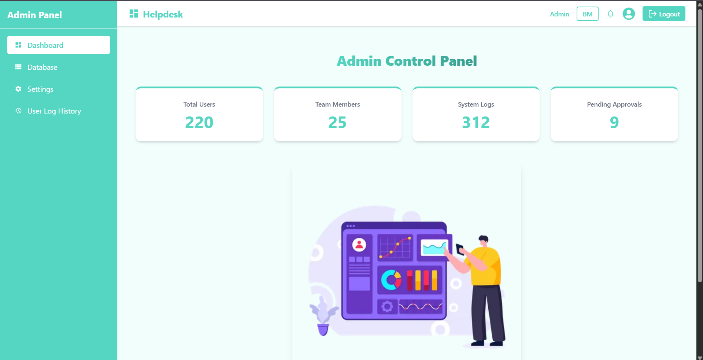
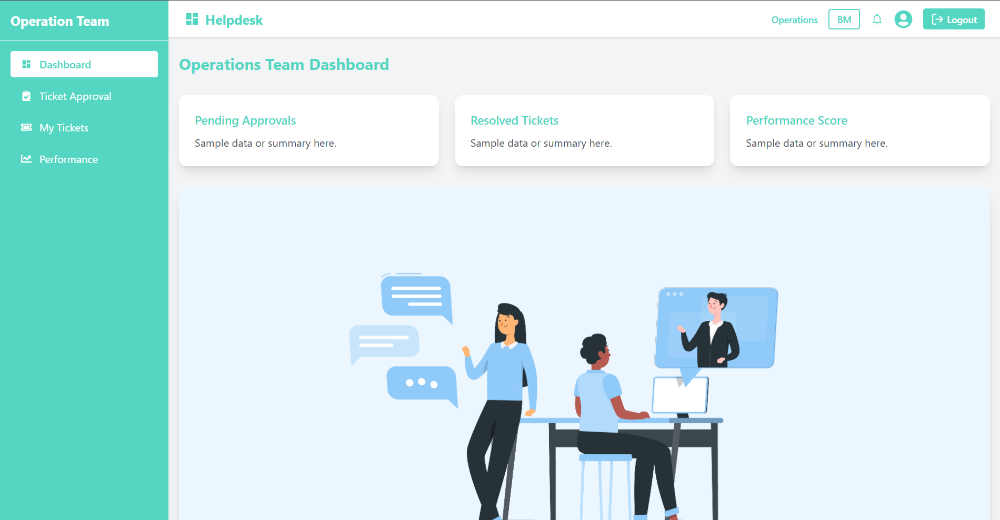
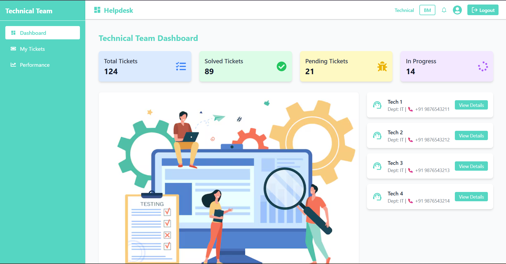
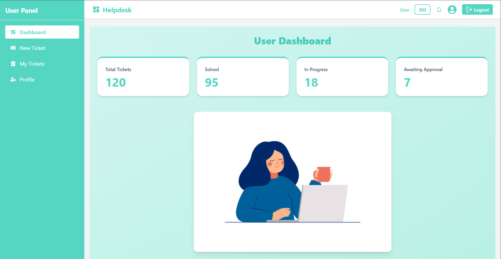

<div align="center">

# Helpdesk: Ticket Management System

**A professional, role-based platform that replaces messy email chains with a clear, automated workflow for company issues.**


<br/>

[Live Demo](https://helpdesk-ruddy-five.vercel.app/) · [GitHub](https://github.com/vasundara-harika/helpdesk) · [LinkedIn](https://www.linkedin.com/in/vasundara-harika)

</div>

---

## Screenshots

| View | Screenshot |
|:---:|:---:|
| **Login Page** |  |
| **Admin Page** |  |
| **Operations Page** |  |
| **Technical Page** |  |
| **User Page** |  |

---

## About

**Helpdesk** is a centralized system designed to organize organizational problems into a clear lifecycle. Instead of lost emails, every issue becomes a trackable ticket.

- **The Workflow:** Users raise issues &rarr; Operations filters & assigns them &rarr; Technical teams resolve them.
- **The Security:** Built with **Role-Based Access Control (RBAC)**, ensuring each user sees a unique UI tailored to their specific job permissions.
- **The Power:** Admins have total oversight, including a dedicated **Database View** to monitor every ticket and system log in the infrastructure.

---

## Features & Role-Based UI

### User (End-User)

- [x] **Raise Tickets** — Submit new Technical or Operational requests.
- [x] **Track Progress** — Real-time view of ticket status (Raised, In Progress, Closed).

### Operations Team

- [x] **Approval** — Approve or Reject incoming tickets to keep the queue clean.
- [x] **Assignment** — Categorize issues and assign them to specific technical experts.

### Technical Team

- [x] **Resolution** — Access a focused list of approved technical bugs.
- [x] **Team Lead** — Create sub-teams and assign a "Person In Charge" (PIC) for complex fixes.

### Admin

- [x] **Full Data Oversight** — Access the Global Database of all tickets.
- [x] **Audit Logs** — View staff sign-in/out history and unauthorized access attempts.

---

## Tech Stack

- **Frontend:** React 19 (Vite), Tailwind CSS, Framer Motion.
- **Backend:** Express.js (Dedicated API for security logging).
- **Routing:** React Router v7 (RBAC Guards).

---

## Project Structure

```
helpdesk/
├── helpdesk-backend/     # Express API for activity & security logging
├── public/               # Static assets & icons
├── src/
│   ├── assets/           # Screenshot1 to Screenshot5
│   ├── components/       # Reusable UI elements
│   ├── data/             # Local mock database
│   ├── layouts/          # UI shells (Admin, Ops, Tech, User)
│   ├── pages/            # Role-specific dashboard logic
│   ├── routes/           # RBAC ProtectedRoute logic
│   └── styles/           # Global and component CSS
├── tailwind.config.js    # Styling configuration
└── vite.config.js        # Build tool settings
```

---

## How to Run Locally

### 1. Clone the Repository

```bash
git clone https://github.com/vasundara-harika/helpdesk.git
cd helpdesk
```

### 2. Set Up the Backend

Open a terminal and run:

```bash
cd helpdesk-backend
npm install
node index.js
```

The server will start on `http://localhost:5000`.

### 3. Set Up the Frontend

Open a **new terminal window** and run:

```bash
# Go back to the root folder
npm install
npm run dev
```

The app will start on `http://localhost:5173`.

### 4. Login Credentials

Use the following demo accounts to test the RBAC features:

| Role | Email | Password |
|:---|:---|:---|
| **Admin** | `admin@helpdesk.com` | `admin123` |
| **Operations** | `ops@helpdesk.com` | `ops123` |
| **Technical** | `tech@helpdesk.com` | `tech123` |
| **User** | `user@helpdesk.com` | `user123` |

---

<div align="center">

### Developer: [Vasundara Harika](https://github.com/vasundara-harika)

**Final Year B.Tech Student | IIIT**

If you found this useful, please star the repo!

&copy; 2025 Helpdesk System. All rights reserved.

</div>
